# Use Case Models Rendered

Mỗi use case gồm: ảnh UML use case và bảng đặc tả ngắn gọn.

## UC01 - Đăng ký

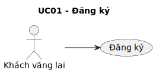

- PlantUML code: [usecase/puml/uc01-dang-ky.puml](usecase/puml/uc01-dang-ky.puml)
- PNG: [images/usecase/png/uc01-dang-ky.png](images/usecase/png/uc01-dang-ky.png)
- PDF: [pdf/usecase/uc01-dang-ky.pdf](pdf/usecase/uc01-dang-ky.pdf)

| Trường | Nội dung |
|---|---|
| Use case | Đăng ký |
| Tác nhân | Khách vãng lai |
| Mục đích | Thực hiện nghiệp vụ đăng ký theo phạm vi chức năng của hệ thống. |
| Mô tả chung | Mô tả tương tác giữa tác nhân và hệ thống khi thực hiện đăng ký. |
| Luồng sự kiện chính | 1. Mở form đăng ký 2. Nhập email và mật khẩu 3. Gửi thông tin đăng ký 4. Kiểm tra email đã tồn tại 5. Tạo tài khoản mới 6. Gửi email xác minh/hướng dẫn đăng nhập |
| Luồng thay thế | Trường hợp email hợp lệ và chưa tồn tại, hệ thống rẽ nhánh xử lý tương ứng Nếu email đã tồn tại hoặc dữ liệu sai, hệ thống trả thông báo phù hợp |
| Các yêu cầu cụ thể | Không có |
| Điều kiện trước | Người dùng chưa có tài khoản trùng thông tin đăng ký |
| Điều kiện sau | Hiển thị lỗi và yêu cầu nhập lại. |

## UC02 - Đăng nhập

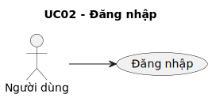

- PlantUML code: [usecase/puml/uc02-dang-nhap.puml](usecase/puml/uc02-dang-nhap.puml)
- PNG: [images/usecase/png/uc02-dang-nhap.png](images/usecase/png/uc02-dang-nhap.png)
- PDF: [pdf/usecase/uc02-dang-nhap.pdf](pdf/usecase/uc02-dang-nhap.pdf)

| Trường | Nội dung |
|---|---|
| Use case | Đăng nhập |
| Tác nhân | Người dùng |
| Mục đích | Thực hiện nghiệp vụ đăng nhập theo phạm vi chức năng của hệ thống. |
| Mô tả chung | Mô tả tương tác giữa tác nhân và hệ thống khi thực hiện đăng nhập. |
| Luồng sự kiện chính | 1. Nhập tài khoản và mật khẩu 2. Gửi yêu cầu đăng nhập 3. Kiểm tra thông tin đăng nhập 4. Yêu cầu mã 2FA 5. Nhập mã 2FA 6. Xác minh mã 2FA |
| Luồng thay thế | Trường hợp tài khoản hợp lệ, hệ thống rẽ nhánh xử lý tương ứng Tùy chọn tài khoản bật 2FA khi điều kiện phù hợp Nếu sai thông tin hoặc bị khóa, hệ thống trả thông báo phù hợp |
| Các yêu cầu cụ thể | Hỗ trợ xác thực 2FA khi tài khoản bật cơ chế bảo mật nâng cao Có thể yêu cầu CAPTCHA với phiên đăng nhập rủi ro |
| Điều kiện trước | Người dùng có tài khoản hợp lệ trong hệ thống |
| Điều kiện sau | Hiển thị lỗi đăng nhập. |

## UC03 - Đăng xuất

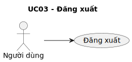

- PlantUML code: [usecase/puml/uc03-dang-xuat.puml](usecase/puml/uc03-dang-xuat.puml)
- PNG: [images/usecase/png/uc03-dang-xuat.png](images/usecase/png/uc03-dang-xuat.png)
- PDF: [pdf/usecase/uc03-dang-xuat.pdf](pdf/usecase/uc03-dang-xuat.pdf)

| Trường | Nội dung |
|---|---|
| Use case | Đăng xuất |
| Tác nhân | Người dùng |
| Mục đích | Thực hiện nghiệp vụ đăng xuất theo phạm vi chức năng của hệ thống. |
| Mô tả chung | Mô tả tương tác giữa tác nhân và hệ thống khi thực hiện đăng xuất. |
| Luồng sự kiện chính | 1. Chọn Đăng xuất 2. Gửi yêu cầu đăng xuất 3. Hủy token/phiên hiện tại 4. Hủy thành công 5. Trả kết quả đăng xuất 6. Xóa token local, chuyển về trang đăng nhập |
| Luồng thay thế | Không có |
| Các yêu cầu cụ thể | Không có |
| Điều kiện trước | Người dùng có quyền truy cập chức năng |
| Điều kiện sau | Xóa token local, chuyển về trang đăng nhập. |

## UC04 - Tìm kiếm việc làm

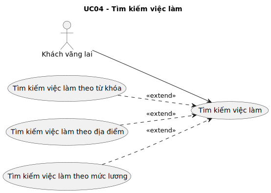

- PlantUML code: [usecase/puml/uc04-tim-kiem-viec-lam.puml](usecase/puml/uc04-tim-kiem-viec-lam.puml)
- PNG: [images/usecase/png/uc04-tim-kiem-viec-lam.png](images/usecase/png/uc04-tim-kiem-viec-lam.png)
- PDF: [pdf/usecase/uc04-tim-kiem-viec-lam.pdf](pdf/usecase/uc04-tim-kiem-viec-lam.pdf)

| Trường | Nội dung |
|---|---|
| Use case | Tìm kiếm việc làm |
| Tác nhân | Khách vãng lai |
| Mục đích | Thực hiện nghiệp vụ tìm kiếm việc làm theo phạm vi chức năng của hệ thống. |
| Mô tả chung | Mô tả tương tác giữa tác nhân và hệ thống khi thực hiện tìm kiếm việc làm. |
| Luồng sự kiện chính | 1. Nhập từ khóa, địa điểm, mức lương 2. Gửi bộ lọc tìm kiếm 3. Truy vấn danh sách việc làm 4. Trả kết quả phù hợp 5. Danh sách việc làm đã lọc 6. Hiển thị kết quả tìm kiếm |
| Luồng thay thế | Không có |
| Các yêu cầu cụ thể | Không có |
| Điều kiện trước | Người dùng có quyền truy cập chức năng |
| Điều kiện sau | Hiển thị kết quả tìm kiếm. |

## UC05 - Xem danh sách việc làm

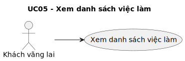

- PlantUML code: [usecase/puml/uc05-xem-danh-sach-viec-lam.puml](usecase/puml/uc05-xem-danh-sach-viec-lam.puml)
- PNG: [images/usecase/png/uc05-xem-danh-sach-viec-lam.png](images/usecase/png/uc05-xem-danh-sach-viec-lam.png)
- PDF: [pdf/usecase/uc05-xem-danh-sach-viec-lam.pdf](pdf/usecase/uc05-xem-danh-sach-viec-lam.pdf)

| Trường | Nội dung |
|---|---|
| Use case | Xem danh sách việc làm |
| Tác nhân | Khách vãng lai |
| Mục đích | Thực hiện nghiệp vụ xem danh sách việc làm theo phạm vi chức năng của hệ thống. |
| Mô tả chung | Mô tả tương tác giữa tác nhân và hệ thống khi thực hiện xem danh sách việc làm. |
| Luồng sự kiện chính | 1. Mở trang danh sách việc làm 2. Yêu cầu danh sách việc làm 3. Lấy danh sách, sắp xếp, phân trang 4. Dữ liệu việc làm 5. Trả về danh sách việc làm 6. Hiển thị danh sách việc làm |
| Luồng thay thế | Không có |
| Các yêu cầu cụ thể | Danh sách dữ liệu cần hỗ trợ phân trang |
| Điều kiện trước | Người dùng có quyền truy cập chức năng |
| Điều kiện sau | Hiển thị danh sách việc làm. |

## UC06 - Xem chi tiết tin tuyển dụng

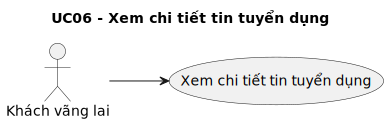

- PlantUML code: [usecase/puml/uc06-xem-chi-tiet-tin-tuyen-dung.puml](usecase/puml/uc06-xem-chi-tiet-tin-tuyen-dung.puml)
- PNG: [images/usecase/png/uc06-xem-chi-tiet-tin-tuyen-dung.png](images/usecase/png/uc06-xem-chi-tiet-tin-tuyen-dung.png)
- PDF: [pdf/usecase/uc06-xem-chi-tiet-tin-tuyen-dung.pdf](pdf/usecase/uc06-xem-chi-tiet-tin-tuyen-dung.pdf)

| Trường | Nội dung |
|---|---|
| Use case | Xem chi tiết tin tuyển dụng |
| Tác nhân | Khách vãng lai |
| Mục đích | Thực hiện nghiệp vụ xem chi tiết tin tuyển dụng theo phạm vi chức năng của hệ thống. |
| Mô tả chung | Mô tả tương tác giữa tác nhân và hệ thống khi thực hiện xem chi tiết tin tuyển dụng. |
| Luồng sự kiện chính | 1. Chọn một tin tuyển dụng 2. Lấy chi tiết tin 3. Truy vấn thông tin tin tuyển dụng 4. Lấy thông tin công ty liên quan 5. Truy vấn hồ sơ công ty 6. Hồ sơ công ty |
| Luồng thay thế | Không có |
| Các yêu cầu cụ thể | Không có |
| Điều kiện trước | Người dùng có quyền truy cập chức năng |
| Điều kiện sau | Hiển thị trang chi tiết. |

## UC07 - Xem mẫu CV

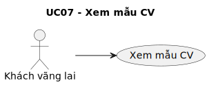

- PlantUML code: [usecase/puml/uc07-xem-mau-cv.puml](usecase/puml/uc07-xem-mau-cv.puml)
- PNG: [images/usecase/png/uc07-xem-mau-cv.png](images/usecase/png/uc07-xem-mau-cv.png)
- PDF: [pdf/usecase/uc07-xem-mau-cv.pdf](pdf/usecase/uc07-xem-mau-cv.pdf)

| Trường | Nội dung |
|---|---|
| Use case | Xem mẫu CV |
| Tác nhân | Khách vãng lai |
| Mục đích | Thực hiện nghiệp vụ xem mẫu CV theo phạm vi chức năng của hệ thống. |
| Mô tả chung | Mô tả tương tác giữa tác nhân và hệ thống khi thực hiện xem mẫu CV. |
| Luồng sự kiện chính | 1. Mở thư viện mẫu CV 2. Yêu cầu danh sách template 3. Lấy danh sách mẫu CV 4. Danh sách template 5. Trả về danh sách và preview 6. Hiển thị mẫu CV |
| Luồng thay thế | Không có |
| Các yêu cầu cụ thể | Không có |
| Điều kiện trước | Người dùng có quyền truy cập chức năng |
| Điều kiện sau | Hiển thị mẫu CV. |

## UC08 - Xem bài viết hướng nghiệp

- PlantUML code: [usecase/puml/uc08-xem-bai-viet-huong-nghiep.puml](usecase/puml/uc08-xem-bai-viet-huong-nghiep.puml)
- PNG: [images/usecase/png/uc08-xem-bai-viet-huong-nghiep.png](images/usecase/png/uc08-xem-bai-viet-huong-nghiep.png)
- PDF: [pdf/usecase/uc08-xem-bai-viet-huong-nghiep.pdf](pdf/usecase/uc08-xem-bai-viet-huong-nghiep.pdf)

| Trường | Nội dung |
|---|---|
| Use case | Xem bài viết hướng nghiệp |
| Tác nhân | Khách vãng lai |
| Mục đích | Thực hiện nghiệp vụ xem bài viết hướng nghiệp theo phạm vi chức năng của hệ thống. |
| Mô tả chung | Mô tả tương tác giữa tác nhân và hệ thống khi thực hiện xem bài viết hướng nghiệp. |
| Luồng sự kiện chính | 1. Mở mục bài viết hướng nghiệp 2. Yêu cầu danh sách bài viết 3. Lấy bài viết đã xuất bản 4. Danh sách bài viết 5. Trả danh sách bài viết 6. Chọn một bài viết |
| Luồng thay thế | Không có |
| Các yêu cầu cụ thể | Không có |
| Điều kiện trước | Người dùng có quyền truy cập chức năng |
| Điều kiện sau | Hiển thị bài viết. |

## UC09 - Cập nhật hồ sơ ứng viên

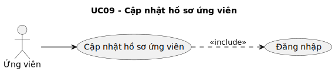

- PlantUML code: [usecase/puml/uc09-cap-nhat-ho-so-ung-vien.puml](usecase/puml/uc09-cap-nhat-ho-so-ung-vien.puml)
- PNG: [images/usecase/png/uc09-cap-nhat-ho-so-ung-vien.png](images/usecase/png/uc09-cap-nhat-ho-so-ung-vien.png)
- PDF: [pdf/usecase/uc09-cap-nhat-ho-so-ung-vien.pdf](pdf/usecase/uc09-cap-nhat-ho-so-ung-vien.pdf)

| Trường | Nội dung |
|---|---|
| Use case | Cập nhật hồ sơ ứng viên |
| Tác nhân | Ứng viên |
| Mục đích | Thực hiện nghiệp vụ cập nhật hồ sơ ứng viên theo phạm vi chức năng của hệ thống. |
| Mô tả chung | Mô tả tương tác giữa tác nhân và hệ thống khi thực hiện cập nhật hồ sơ ứng viên. |
| Luồng sự kiện chính | 1. Hệ thống kiểm tra trạng thái đăng nhập trước khi xử lý chức năng 2. Mở trang hồ sơ ứng viên 3. Kiểm tra đăng nhập 4. Phiên hợp lệ 5. Lấy dữ liệu hồ sơ hiện tại 6. Đọc hồ sơ ứng viên |
| Luồng thay thế | Không có |
| Các yêu cầu cụ thể | Không có |
| Điều kiện trước | Người dùng đã đăng nhập vào hệ thống |
| Điều kiện sau | Thông báo cập nhật thành công. |

## UC10 - Quản lý CV

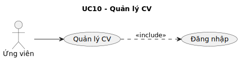

- PlantUML code: [usecase/puml/uc10-quan-ly-cv.puml](usecase/puml/uc10-quan-ly-cv.puml)
- PNG: [images/usecase/png/uc10-quan-ly-cv.png](images/usecase/png/uc10-quan-ly-cv.png)
- PDF: [pdf/usecase/uc10-quan-ly-cv.pdf](pdf/usecase/uc10-quan-ly-cv.pdf)

| Trường | Nội dung |
|---|---|
| Use case | Quản lý CV |
| Tác nhân | Ứng viên |
| Mục đích | Thực hiện nghiệp vụ quản lý CV theo phạm vi chức năng của hệ thống. |
| Mô tả chung | Mô tả tương tác giữa tác nhân và hệ thống khi thực hiện quản lý CV. |
| Luồng sự kiện chính | 1. Hệ thống kiểm tra trạng thái đăng nhập trước khi xử lý chức năng 2. Mở trang quản lý CV 3. Kiểm tra đăng nhập 4. Phiên hợp lệ 5. Lấy danh sách CV 6. Truy vấn danh sách CV |
| Luồng thay thế | Trường hợp tải lên tệp CV, hệ thống rẽ nhánh xử lý tương ứng |
| Các yêu cầu cụ thể | Hỗ trợ tải tệp đính kèm khi nghiệp vụ có yêu cầu |
| Điều kiện trước | Người dùng đã đăng nhập vào hệ thống |
| Điều kiện sau | Hiển thị danh sách CV đã cập nhật. |

## UC11 - Lưu tin tuyển dụng

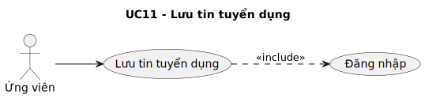

- PlantUML code: [usecase/puml/uc11-luu-tin-tuyen-dung.puml](usecase/puml/uc11-luu-tin-tuyen-dung.puml)
- PNG: [images/usecase/png/uc11-luu-tin-tuyen-dung.png](images/usecase/png/uc11-luu-tin-tuyen-dung.png)
- PDF: [pdf/usecase/uc11-luu-tin-tuyen-dung.pdf](pdf/usecase/uc11-luu-tin-tuyen-dung.pdf)

| Trường | Nội dung |
|---|---|
| Use case | Lưu tin tuyển dụng |
| Tác nhân | Ứng viên |
| Mục đích | Thực hiện nghiệp vụ lưu tin tuyển dụng theo phạm vi chức năng của hệ thống. |
| Mô tả chung | Mô tả tương tác giữa tác nhân và hệ thống khi thực hiện lưu tin tuyển dụng. |
| Luồng sự kiện chính | 1. Hệ thống kiểm tra trạng thái đăng nhập trước khi xử lý chức năng 2. Chọn Lưu tin trên tin tuyển dụng 3. Kiểm tra đăng nhập 4. Phiên không hợp lệ 5. Yêu cầu đăng nhập 6. Gửi yêu cầu lưu tin |
| Luồng thay thế | Trường hợp chưa đăng nhập, hệ thống rẽ nhánh xử lý tương ứng Nếu đã đăng nhập, hệ thống trả thông báo phù hợp |
| Các yêu cầu cụ thể | Không có |
| Điều kiện trước | Người dùng đã đăng nhập vào hệ thống |
| Điều kiện sau | Cập nhật icon và thông báo thành công. |

## UC12 - Ứng tuyển

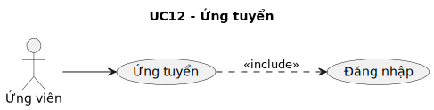

- PlantUML code: [usecase/puml/uc12-ung-tuyen.puml](usecase/puml/uc12-ung-tuyen.puml)
- PNG: [images/usecase/png/uc12-ung-tuyen.png](images/usecase/png/uc12-ung-tuyen.png)
- PDF: [pdf/usecase/uc12-ung-tuyen.pdf](pdf/usecase/uc12-ung-tuyen.pdf)

| Trường | Nội dung |
|---|---|
| Use case | Ứng tuyển |
| Tác nhân | Ứng viên |
| Mục đích | Thực hiện nghiệp vụ ứng tuyển theo phạm vi chức năng của hệ thống. |
| Mô tả chung | Mô tả tương tác giữa tác nhân và hệ thống khi thực hiện ứng tuyển. |
| Luồng sự kiện chính | 1. Hệ thống kiểm tra trạng thái đăng nhập trước khi xử lý chức năng 2. Nhận Ứng tuyển 3. Kiểm tra đăng nhập 4. Phiên không hợp lệ 5. Chuyển đến trang đăng nhập 6. Kiểm tra CV/mặc định hồ sơ ứng tuyển |
| Luồng thay thế | Trường hợp chưa đăng nhập, hệ thống rẽ nhánh xử lý tương ứng Nếu đã đăng nhập, hệ thống trả thông báo phù hợp Trường hợp hồ sơ/CV hợp lệ, hệ thống rẽ nhánh xử lý tương ứng |
| Các yêu cầu cụ thể | Không có |
| Điều kiện trước | Người dùng đã đăng nhập vào hệ thống |
| Điều kiện sau | Yêu cầu bổ sung hồ sơ. |

## UC13 - Xem danh sách đã ứng tuyển

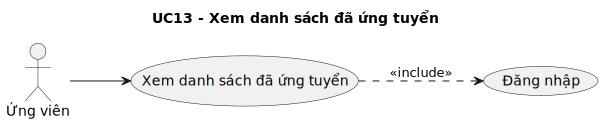

- PlantUML code: [usecase/puml/uc13-xem-danh-sach-da-ung-tuyen.puml](usecase/puml/uc13-xem-danh-sach-da-ung-tuyen.puml)
- PNG: [images/usecase/png/uc13-xem-danh-sach-da-ung-tuyen.png](images/usecase/png/uc13-xem-danh-sach-da-ung-tuyen.png)
- PDF: [pdf/usecase/uc13-xem-danh-sach-da-ung-tuyen.pdf](pdf/usecase/uc13-xem-danh-sach-da-ung-tuyen.pdf)

| Trường | Nội dung |
|---|---|
| Use case | Xem danh sách đã ứng tuyển |
| Tác nhân | Ứng viên |
| Mục đích | Thực hiện nghiệp vụ xem danh sách đã ứng tuyển theo phạm vi chức năng của hệ thống. |
| Mô tả chung | Mô tả tương tác giữa tác nhân và hệ thống khi thực hiện xem danh sách đã ứng tuyển. |
| Luồng sự kiện chính | 1. Hệ thống kiểm tra trạng thái đăng nhập trước khi xử lý chức năng 2. Mở trang Đã ứng tuyển 3. Kiểm tra đăng nhập 4. Phiên hợp lệ 5. Yêu cầu danh sách hồ sơ ứng tuyển 6. Truy vấn danh sách hồ sơ của ứng viên |
| Luồng thay thế | Không có |
| Các yêu cầu cụ thể | Không có |
| Điều kiện trước | Người dùng đã đăng nhập vào hệ thống |
| Điều kiện sau | Hiển thị danh sách và trạng thái xử lý. |

## UC14 - Bình luận/Đánh giá công ty

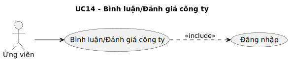

- PlantUML code: [usecase/puml/uc14-binh-luan-danh-gia-cong-ty.puml](usecase/puml/uc14-binh-luan-danh-gia-cong-ty.puml)
- PNG: [images/usecase/png/uc14-binh-luan-danh-gia-cong-ty.png](images/usecase/png/uc14-binh-luan-danh-gia-cong-ty.png)
- PDF: [pdf/usecase/uc14-binh-luan-danh-gia-cong-ty.pdf](pdf/usecase/uc14-binh-luan-danh-gia-cong-ty.pdf)

| Trường | Nội dung |
|---|---|
| Use case | Bình luận/Đánh giá công ty |
| Tác nhân | Ứng viên |
| Mục đích | Thực hiện nghiệp vụ bình luận/Đánh giá công ty theo phạm vi chức năng của hệ thống. |
| Mô tả chung | Mô tả tương tác giữa tác nhân và hệ thống khi thực hiện bình luận/Đánh giá công ty. |
| Luồng sự kiện chính | 1. Hệ thống kiểm tra trạng thái đăng nhập trước khi xử lý chức năng 2. Mở trang công ty và nhập đánh giá 3. Kiểm tra đăng nhập 4. Phiên không hợp lệ 5. Yêu cầu đăng nhập 6. Gửi điểm đánh giá và bình luận |
| Luồng thay thế | Trường hợp chưa đăng nhập, hệ thống rẽ nhánh xử lý tương ứng Nếu đã đăng nhập, hệ thống trả thông báo phù hợp Trường hợp được phép gửi, hệ thống rẽ nhánh xử lý tương ứng |
| Các yêu cầu cụ thể | Không có |
| Điều kiện trước | Người dùng đã đăng nhập vào hệ thống |
| Điều kiện sau | Hiển thị lỗi. |

## UC15 - Quản lý ứng tuyển

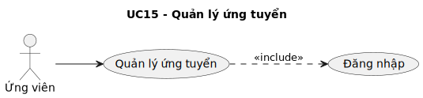

- PlantUML code: [usecase/puml/uc15-quan-ly-ung-tuyen.puml](usecase/puml/uc15-quan-ly-ung-tuyen.puml)
- PNG: [images/usecase/png/uc15-quan-ly-ung-tuyen.png](images/usecase/png/uc15-quan-ly-ung-tuyen.png)
- PDF: [pdf/usecase/uc15-quan-ly-ung-tuyen.pdf](pdf/usecase/uc15-quan-ly-ung-tuyen.pdf)

| Trường | Nội dung |
|---|---|
| Use case | Quản lý ứng tuyển |
| Tác nhân | Ứng viên |
| Mục đích | Thực hiện nghiệp vụ quản lý ứng tuyển theo phạm vi chức năng của hệ thống. |
| Mô tả chung | Mô tả tương tác giữa tác nhân và hệ thống khi thực hiện quản lý ứng tuyển. |
| Luồng sự kiện chính | 1. Hệ thống kiểm tra trạng thái đăng nhập trước khi xử lý chức năng 2. Mở trang Quản lý ứng tuyển 3. Kiểm tra đăng nhập 4. Phiên hợp lệ 5. Lấy danh sách hồ sơ và trạng thái 6. Truy vấn hồ sơ ứng tuyển |
| Luồng thay thế | Không có |
| Các yêu cầu cụ thể | Không có |
| Điều kiện trước | Người dùng đã đăng nhập vào hệ thống |
| Điều kiện sau | Hiển thị trạng thái mới. |

## UC16 - Bình luận bài viết hướng nghiệp

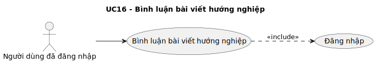

- PlantUML code: [usecase/puml/uc16-binh-luan-bai-viet-huong-nghiep.puml](usecase/puml/uc16-binh-luan-bai-viet-huong-nghiep.puml)
- PNG: [images/usecase/png/uc16-binh-luan-bai-viet-huong-nghiep.png](images/usecase/png/uc16-binh-luan-bai-viet-huong-nghiep.png)
- PDF: [pdf/usecase/uc16-binh-luan-bai-viet-huong-nghiep.pdf](pdf/usecase/uc16-binh-luan-bai-viet-huong-nghiep.pdf)

| Trường | Nội dung |
|---|---|
| Use case | Bình luận bài viết hướng nghiệp |
| Tác nhân | Người dùng đã đăng nhập |
| Mục đích | Thực hiện nghiệp vụ bình luận bài viết hướng nghiệp theo phạm vi chức năng của hệ thống. |
| Mô tả chung | Mô tả tương tác giữa tác nhân và hệ thống khi thực hiện bình luận bài viết hướng nghiệp. |
| Luồng sự kiện chính | 1. Hệ thống kiểm tra trạng thái đăng nhập trước khi xử lý chức năng 2. Nhập bình luận bài viết 3. Kiểm tra đăng nhập 4. Phiên không hợp lệ 5. Yêu cầu đăng nhập 6. Gửi nội dung bình luận |
| Luồng thay thế | Trường hợp chưa đăng nhập, hệ thống rẽ nhánh xử lý tương ứng Nếu đã đăng nhập, hệ thống trả thông báo phù hợp |
| Các yêu cầu cụ thể | Không có |
| Điều kiện trước | Người dùng đã đăng nhập vào hệ thống |
| Điều kiện sau | Hiển thị bình luận vừa gửi. |

## UC17 - Báo cáo (tin/người dùng/công ty)

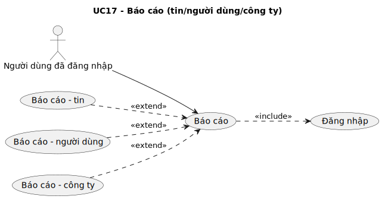

- PlantUML code: [usecase/puml/uc17-bao-cao.puml](usecase/puml/uc17-bao-cao.puml)
- PNG: [images/usecase/png/uc17-bao-cao.png](images/usecase/png/uc17-bao-cao.png)
- PDF: [pdf/usecase/uc17-bao-cao.pdf](pdf/usecase/uc17-bao-cao.pdf)

| Trường | Nội dung |
|---|---|
| Use case | Báo cáo |
| Tác nhân | Người dùng đã đăng nhập |
| Mục đích | Thực hiện nghiệp vụ báo cáo theo phạm vi chức năng của hệ thống. |
| Mô tả chung | Mô tả tương tác giữa tác nhân và hệ thống khi thực hiện báo cáo. |
| Luồng sự kiện chính | 1. Hệ thống kiểm tra trạng thái đăng nhập trước khi xử lý chức năng 2. Chọn Báo cáo đối tượng 3. Kiểm tra đăng nhập 4. Phiên không hợp lệ 5. Yêu cầu đăng nhập 6. Chọn loại báo cáo và lý do |
| Luồng thay thế | Trường hợp chưa đăng nhập, hệ thống rẽ nhánh xử lý tương ứng Nếu đã đăng nhập, hệ thống trả thông báo phù hợp |
| Các yêu cầu cụ thể | Không có |
| Điều kiện trước | Người dùng đã đăng nhập vào hệ thống |
| Điều kiện sau | Hiển thị báo cáo đã được ghi nhận. |

## UC18 - Nhắn tin

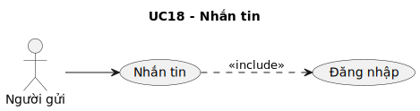

- PlantUML code: [usecase/puml/uc18-nhan-tin.puml](usecase/puml/uc18-nhan-tin.puml)
- PNG: [images/usecase/png/uc18-nhan-tin.png](images/usecase/png/uc18-nhan-tin.png)
- PDF: [pdf/usecase/uc18-nhan-tin.pdf](pdf/usecase/uc18-nhan-tin.pdf)

| Trường | Nội dung |
|---|---|
| Use case | Nhắn tin |
| Tác nhân | Người gửi |
| Mục đích | Thực hiện nghiệp vụ nhắn tin theo phạm vi chức năng của hệ thống. |
| Mô tả chung | Mô tả tương tác giữa tác nhân và hệ thống khi thực hiện nhắn tin. |
| Luồng sự kiện chính | 1. Hệ thống kiểm tra trạng thái đăng nhập trước khi xử lý chức năng 2. Mở hội thoại và nhập tin nhắn 3. Kiểm tra đăng nhập 4. Phiên hợp lệ 5. Gửi tin nhắn 6. Lưu nội dung tin nhắn |
| Luồng thay thế | Không có |
| Các yêu cầu cụ thể | Yêu cầu cơ chế realtime để đồng bộ dữ liệu tức thời |
| Điều kiện trước | Người dùng đã đăng nhập vào hệ thống |
| Điều kiện sau | Hiển thị tin nhắn mới. |

## UC19 - Quản lý nhật ký

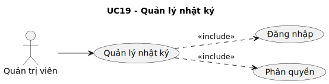

- PlantUML code: [usecase/puml/uc19-quan-ly-nhat-ky.puml](usecase/puml/uc19-quan-ly-nhat-ky.puml)
- PNG: [images/usecase/png/uc19-quan-ly-nhat-ky.png](images/usecase/png/uc19-quan-ly-nhat-ky.png)
- PDF: [pdf/usecase/uc19-quan-ly-nhat-ky.pdf](pdf/usecase/uc19-quan-ly-nhat-ky.pdf)

| Trường | Nội dung |
|---|---|
| Use case | Quản lý nhật ký |
| Tác nhân | Quản trị viên |
| Mục đích | Thực hiện nghiệp vụ quản lý nhật ký theo phạm vi chức năng của hệ thống. |
| Mô tả chung | Mô tả tương tác giữa tác nhân và hệ thống khi thực hiện quản lý nhật ký. |
| Luồng sự kiện chính | 1. Hệ thống kiểm tra trạng thái đăng nhập trước khi xử lý chức năng 2. Hệ thống kiểm tra quyền truy cập của tác nhân 3. Mở màn hình quản lý nhật ký 4. Kiểm tra đăng nhập và quyền 5. Hợp lệ 6. Yêu cầu danh sách nhật ký theo bộ lọc |
| Luồng thay thế | Không có |
| Các yêu cầu cụ thể | Không có |
| Điều kiện trước | Người dùng đã đăng nhập vào hệ thống |
| Điều kiện sau | Hiển thị nhật ký hoặc file xuất. |

## UC20 - Quản lý tin tuyển dụng

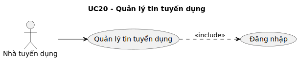

- PlantUML code: [usecase/puml/uc20-quan-ly-tin-tuyen-dung.puml](usecase/puml/uc20-quan-ly-tin-tuyen-dung.puml)
- PNG: [images/usecase/png/uc20-quan-ly-tin-tuyen-dung.png](images/usecase/png/uc20-quan-ly-tin-tuyen-dung.png)
- PDF: [pdf/usecase/uc20-quan-ly-tin-tuyen-dung.pdf](pdf/usecase/uc20-quan-ly-tin-tuyen-dung.pdf)

| Trường | Nội dung |
|---|---|
| Use case | Quản lý tin tuyển dụng |
| Tác nhân | Nhà tuyển dụng |
| Mục đích | Thực hiện nghiệp vụ quản lý tin tuyển dụng theo phạm vi chức năng của hệ thống. |
| Mô tả chung | Mô tả tương tác giữa tác nhân và hệ thống khi thực hiện quản lý tin tuyển dụng. |
| Luồng sự kiện chính | 1. Hệ thống kiểm tra trạng thái đăng nhập trước khi xử lý chức năng 2. Mở trang quản lý tin tuyển dụng 3. Kiểm tra đăng nhập 4. Phiên hợp lệ 5. Lấy danh sách tin của nhà tuyển dụng 6. Truy vấn tin tuyển dụng |
| Luồng thay thế | Không có |
| Các yêu cầu cụ thể | Không có |
| Điều kiện trước | Người dùng đã đăng nhập vào hệ thống |
| Điều kiện sau | Hiển thị trạng thái mới của tin. |

## UC21 - Lưu CV ứng viên

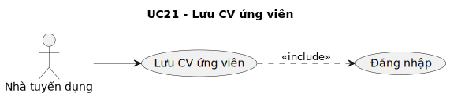

- PlantUML code: [usecase/puml/uc21-luu-cv-ung-vien.puml](usecase/puml/uc21-luu-cv-ung-vien.puml)
- PNG: [images/usecase/png/uc21-luu-cv-ung-vien.png](images/usecase/png/uc21-luu-cv-ung-vien.png)
- PDF: [pdf/usecase/uc21-luu-cv-ung-vien.pdf](pdf/usecase/uc21-luu-cv-ung-vien.pdf)

| Trường | Nội dung |
|---|---|
| Use case | Lưu CV ứng viên |
| Tác nhân | Nhà tuyển dụng |
| Mục đích | Thực hiện nghiệp vụ lưu CV ứng viên theo phạm vi chức năng của hệ thống. |
| Mô tả chung | Mô tả tương tác giữa tác nhân và hệ thống khi thực hiện lưu CV ứng viên. |
| Luồng sự kiện chính | 1. Hệ thống kiểm tra trạng thái đăng nhập trước khi xử lý chức năng 2. Xem CV ứng viên 3. Kiểm tra đăng nhập 4. Phiên hợp lệ 5. Chọn Lưu CV ứng viên 6. Gửi yêu cầu lưu CV vào danh sách quan tâm |
| Luồng thay thế | Không có |
| Các yêu cầu cụ thể | Không có |
| Điều kiện trước | Người dùng đã đăng nhập vào hệ thống |
| Điều kiện sau | Hiển thị thông báo thành công. |

## UC22 - Xem đánh giá/bình luận công ty

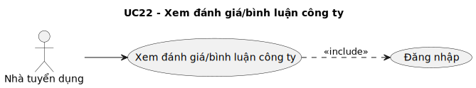

- PlantUML code: [usecase/puml/uc22-xem-danh-gia-binh-luan-cong-ty.puml](usecase/puml/uc22-xem-danh-gia-binh-luan-cong-ty.puml)
- PNG: [images/usecase/png/uc22-xem-danh-gia-binh-luan-cong-ty.png](images/usecase/png/uc22-xem-danh-gia-binh-luan-cong-ty.png)
- PDF: [pdf/usecase/uc22-xem-danh-gia-binh-luan-cong-ty.pdf](pdf/usecase/uc22-xem-danh-gia-binh-luan-cong-ty.pdf)

| Trường | Nội dung |
|---|---|
| Use case | Xem đánh giá/bình luận công ty |
| Tác nhân | Nhà tuyển dụng |
| Mục đích | Thực hiện nghiệp vụ xem đánh giá/bình luận công ty theo phạm vi chức năng của hệ thống. |
| Mô tả chung | Mô tả tương tác giữa tác nhân và hệ thống khi thực hiện xem đánh giá/bình luận công ty. |
| Luồng sự kiện chính | 1. Hệ thống kiểm tra trạng thái đăng nhập trước khi xử lý chức năng 2. Mở khu vực đánh giá công ty 3. Kiểm tra đăng nhập 4. Phiên hợp lệ 5. Yêu cầu danh sách đánh giá/bình luận 6. Truy vấn đánh giá của công ty |
| Luồng thay thế | Không có |
| Các yêu cầu cụ thể | Không có |
| Điều kiện trước | Người dùng đã đăng nhập vào hệ thống |
| Điều kiện sau | Hiển thị đánh giá/bình luận. |

## UC23 - Quản lý báo cáo

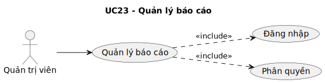

- PlantUML code: [usecase/puml/uc23-quan-ly-bao-cao.puml](usecase/puml/uc23-quan-ly-bao-cao.puml)
- PNG: [images/usecase/png/uc23-quan-ly-bao-cao.png](images/usecase/png/uc23-quan-ly-bao-cao.png)
- PDF: [pdf/usecase/uc23-quan-ly-bao-cao.pdf](pdf/usecase/uc23-quan-ly-bao-cao.pdf)

| Trường | Nội dung |
|---|---|
| Use case | Quản lý báo cáo |
| Tác nhân | Quản trị viên |
| Mục đích | Thực hiện nghiệp vụ quản lý báo cáo theo phạm vi chức năng của hệ thống. |
| Mô tả chung | Mô tả tương tác giữa tác nhân và hệ thống khi thực hiện quản lý báo cáo. |
| Luồng sự kiện chính | 1. Hệ thống kiểm tra trạng thái đăng nhập trước khi xử lý chức năng 2. Hệ thống kiểm tra quyền truy cập của tác nhân 3. Mở màn hình quản lý báo cáo 4. Kiểm tra đăng nhập và quyền 5. Hợp lệ 6. Lấy danh sách báo cáo cho xử lý |
| Luồng thay thế | Không có |
| Các yêu cầu cụ thể | Không có |
| Điều kiện trước | Người dùng đã đăng nhập vào hệ thống |
| Điều kiện sau | Hiển thị trạng thái báo cáo đã cập nhật. |

## UC24 - Quản lý bài viết hướng nghiệp

- PlantUML code: [usecase/puml/uc24-quan-ly-bai-viet-huong-nghiep.puml](usecase/puml/uc24-quan-ly-bai-viet-huong-nghiep.puml)
- PNG: [images/usecase/png/uc24-quan-ly-bai-viet-huong-nghiep.png](images/usecase/png/uc24-quan-ly-bai-viet-huong-nghiep.png)
- PDF: [pdf/usecase/uc24-quan-ly-bai-viet-huong-nghiep.pdf](pdf/usecase/uc24-quan-ly-bai-viet-huong-nghiep.pdf)

| Trường | Nội dung |
|---|---|
| Use case | Quản lý bài viết hướng nghiệp |
| Tác nhân | Nhà tuyển dụng |
| Mục đích | Thực hiện nghiệp vụ quản lý bài viết hướng nghiệp theo phạm vi chức năng của hệ thống. |
| Mô tả chung | Mô tả tương tác giữa tác nhân và hệ thống khi thực hiện quản lý bài viết hướng nghiệp. |
| Luồng sự kiện chính | 1. Hệ thống kiểm tra trạng thái đăng nhập trước khi xử lý chức năng 2. Mở trang quản lý bài viết hướng nghiệp 3. Kiểm tra đăng nhập 4. Phiên hợp lệ 5. Lấy danh sách bài viết hiện có 6. Truy vấn bài viết |
| Luồng thay thế | Tùy chọn bài viết có ảnh đính kèm khi điều kiện phù hợp |
| Các yêu cầu cụ thể | Hỗ trợ tải tệp đính kèm khi nghiệp vụ có yêu cầu |
| Điều kiện trước | Người dùng đã đăng nhập vào hệ thống |
| Điều kiện sau | Hiển thị trạng thái bài viết mới. |

## UC25 - Quản lý hồ sơ nhà tuyển dụng

- PlantUML code: [usecase/puml/uc25-quan-ly-ho-so-nha-tuyen-dung.puml](usecase/puml/uc25-quan-ly-ho-so-nha-tuyen-dung.puml)
- PNG: [images/usecase/png/uc25-quan-ly-ho-so-nha-tuyen-dung.png](images/usecase/png/uc25-quan-ly-ho-so-nha-tuyen-dung.png)
- PDF: [pdf/usecase/uc25-quan-ly-ho-so-nha-tuyen-dung.pdf](pdf/usecase/uc25-quan-ly-ho-so-nha-tuyen-dung.pdf)

| Trường | Nội dung |
|---|---|
| Use case | Quản lý hồ sơ nhà tuyển dụng |
| Tác nhân | Nhà tuyển dụng |
| Mục đích | Thực hiện nghiệp vụ quản lý hồ sơ nhà tuyển dụng theo phạm vi chức năng của hệ thống. |
| Mô tả chung | Mô tả tương tác giữa tác nhân và hệ thống khi thực hiện quản lý hồ sơ nhà tuyển dụng. |
| Luồng sự kiện chính | 1. Hệ thống kiểm tra trạng thái đăng nhập trước khi xử lý chức năng 2. Mở trang hồ sơ nhà tuyển dụng 3. Kiểm tra đăng nhập 4. Phiên hợp lệ 5. Lấy thông tin hồ sơ hiện tại 6. Truy vấn hồ sơ công ty |
| Luồng thay thế | Tùy chọn cập nhật logo/tệp khi điều kiện phù hợp |
| Các yêu cầu cụ thể | Hỗ trợ tải tệp đính kèm khi nghiệp vụ có yêu cầu |
| Điều kiện trước | Người dùng đã đăng nhập vào hệ thống |
| Điều kiện sau | Hiển thị hồ sơ đã cập nhật. |

## UC26 - Quản lý người dùng

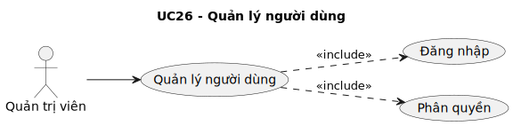

- PlantUML code: [usecase/puml/uc26-quan-ly-nguoi-dung.puml](usecase/puml/uc26-quan-ly-nguoi-dung.puml)
- PNG: [images/usecase/png/uc26-quan-ly-nguoi-dung.png](images/usecase/png/uc26-quan-ly-nguoi-dung.png)
- PDF: [pdf/usecase/uc26-quan-ly-nguoi-dung.pdf](pdf/usecase/uc26-quan-ly-nguoi-dung.pdf)

| Trường | Nội dung |
|---|---|
| Use case | Quản lý người dùng |
| Tác nhân | Quản trị viên |
| Mục đích | Thực hiện nghiệp vụ quản lý người dùng theo phạm vi chức năng của hệ thống. |
| Mô tả chung | Mô tả tương tác giữa tác nhân và hệ thống khi thực hiện quản lý người dùng. |
| Luồng sự kiện chính | 1. Hệ thống kiểm tra trạng thái đăng nhập trước khi xử lý chức năng 2. Hệ thống kiểm tra quyền truy cập của tác nhân 3. Mở màn hình quản lý người dùng 4. Kiểm tra đăng nhập và quyền 5. Hợp lệ 6. Lấy danh sách người dùng |
| Luồng thay thế | Tùy chọn gán vai trò/quyền khi điều kiện phù hợp |
| Các yêu cầu cụ thể | Không có |
| Điều kiện trước | Người dùng đã đăng nhập vào hệ thống |
| Điều kiện sau | Hiển thị trạng thái người dùng mới. |

## UC27 - Quản lý bài đăng

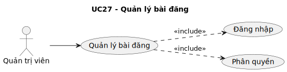

- PlantUML code: [usecase/puml/uc27-quan-ly-bai-dang.puml](usecase/puml/uc27-quan-ly-bai-dang.puml)
- PNG: [images/usecase/png/uc27-quan-ly-bai-dang.png](images/usecase/png/uc27-quan-ly-bai-dang.png)
- PDF: [pdf/usecase/uc27-quan-ly-bai-dang.pdf](pdf/usecase/uc27-quan-ly-bai-dang.pdf)

| Trường | Nội dung |
|---|---|
| Use case | Quản lý bài đăng |
| Tác nhân | Quản trị viên |
| Mục đích | Thực hiện nghiệp vụ quản lý bài đăng theo phạm vi chức năng của hệ thống. |
| Mô tả chung | Mô tả tương tác giữa tác nhân và hệ thống khi thực hiện quản lý bài đăng. |
| Luồng sự kiện chính | 1. Hệ thống kiểm tra trạng thái đăng nhập trước khi xử lý chức năng 2. Hệ thống kiểm tra quyền truy cập của tác nhân 3. Mở màn hình quản lý bài đăng 4. Kiểm tra đăng nhập và quyền 5. Hợp lệ 6. Lấy danh sách bài đăng |
| Luồng thay thế | Không có |
| Các yêu cầu cụ thể | Không có |
| Điều kiện trước | Người dùng đã đăng nhập vào hệ thống |
| Điều kiện sau | Hiển thị trạng thái bài đăng mới. |

## UC28 - Quản lý đánh giá công ty

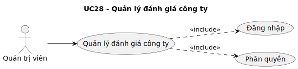

- PlantUML code: [usecase/puml/uc28-quan-ly-danh-gia-cong-ty.puml](usecase/puml/uc28-quan-ly-danh-gia-cong-ty.puml)
- PNG: [images/usecase/png/uc28-quan-ly-danh-gia-cong-ty.png](images/usecase/png/uc28-quan-ly-danh-gia-cong-ty.png)
- PDF: [pdf/usecase/uc28-quan-ly-danh-gia-cong-ty.pdf](pdf/usecase/uc28-quan-ly-danh-gia-cong-ty.pdf)

| Trường | Nội dung |
|---|---|
| Use case | Quản lý đánh giá công ty |
| Tác nhân | Quản trị viên |
| Mục đích | Thực hiện nghiệp vụ quản lý đánh giá công ty theo phạm vi chức năng của hệ thống. |
| Mô tả chung | Mô tả tương tác giữa tác nhân và hệ thống khi thực hiện quản lý đánh giá công ty. |
| Luồng sự kiện chính | 1. Hệ thống kiểm tra trạng thái đăng nhập trước khi xử lý chức năng 2. Hệ thống kiểm tra quyền truy cập của tác nhân 3. Mở màn hình quản lý đánh giá công ty 4. Kiểm tra đăng nhập và quyền 5. Hợp lệ 6. Lấy danh sách đánh giá/bình luận |
| Luồng thay thế | Không có |
| Các yêu cầu cụ thể | Không có |
| Điều kiện trước | Người dùng đã đăng nhập vào hệ thống |
| Điều kiện sau | Hiển thị trạng thái mới. |

## UC29 - Quản lý template

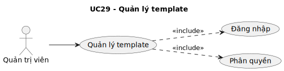

- PlantUML code: [usecase/puml/uc29-quan-ly-template.puml](usecase/puml/uc29-quan-ly-template.puml)
- PNG: [images/usecase/png/uc29-quan-ly-template.png](images/usecase/png/uc29-quan-ly-template.png)
- PDF: [pdf/usecase/uc29-quan-ly-template.pdf](pdf/usecase/uc29-quan-ly-template.pdf)

| Trường | Nội dung |
|---|---|
| Use case | Quản lý template |
| Tác nhân | Quản trị viên |
| Mục đích | Thực hiện nghiệp vụ quản lý template theo phạm vi chức năng của hệ thống. |
| Mô tả chung | Mô tả tương tác giữa tác nhân và hệ thống khi thực hiện quản lý template. |
| Luồng sự kiện chính | 1. Hệ thống kiểm tra trạng thái đăng nhập trước khi xử lý chức năng 2. Hệ thống kiểm tra quyền truy cập của tác nhân 3. Mở màn hình quản lý template 4. Kiểm tra đăng nhập và quyền 5. Hợp lệ 6. Lấy danh sách template |
| Luồng thay thế | Tùy chọn có tệp giao diện/template khi điều kiện phù hợp |
| Các yêu cầu cụ thể | Hỗ trợ tải tệp đính kèm khi nghiệp vụ có yêu cầu |
| Điều kiện trước | Người dùng đã đăng nhập vào hệ thống |
| Điều kiện sau | Hiển thị trạng thái template mới. |

## UC30 - Quản lý cẩm nang nghề nghiệp

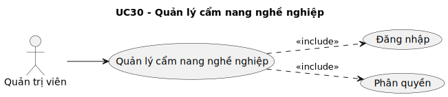

- PlantUML code: [usecase/puml/uc30-quan-ly-cam-nang-nghe-nghiep.puml](usecase/puml/uc30-quan-ly-cam-nang-nghe-nghiep.puml)
- PNG: [images/usecase/png/uc30-quan-ly-cam-nang-nghe-nghiep.png](images/usecase/png/uc30-quan-ly-cam-nang-nghe-nghiep.png)
- PDF: [pdf/usecase/uc30-quan-ly-cam-nang-nghe-nghiep.pdf](pdf/usecase/uc30-quan-ly-cam-nang-nghe-nghiep.pdf)

| Trường | Nội dung |
|---|---|
| Use case | Quản lý cẩm nang nghề nghiệp |
| Tác nhân | Quản trị viên |
| Mục đích | Thực hiện nghiệp vụ quản lý cẩm nang nghề nghiệp theo phạm vi chức năng của hệ thống. |
| Mô tả chung | Mô tả tương tác giữa tác nhân và hệ thống khi thực hiện quản lý cẩm nang nghề nghiệp. |
| Luồng sự kiện chính | 1. Hệ thống kiểm tra trạng thái đăng nhập trước khi xử lý chức năng 2. Hệ thống kiểm tra quyền truy cập của tác nhân 3. Mở màn hình quản lý cẩm nang nghề nghiệp 4. Kiểm tra đăng nhập và quyền 5. Hợp lệ 6. Lấy danh mục và bài viết cẩm nang |
| Luồng thay thế | Không có |
| Các yêu cầu cụ thể | Không có |
| Điều kiện trước | Người dùng đã đăng nhập vào hệ thống |
| Điều kiện sau | Hiển thị cẩm nang đã cập nhật. |

